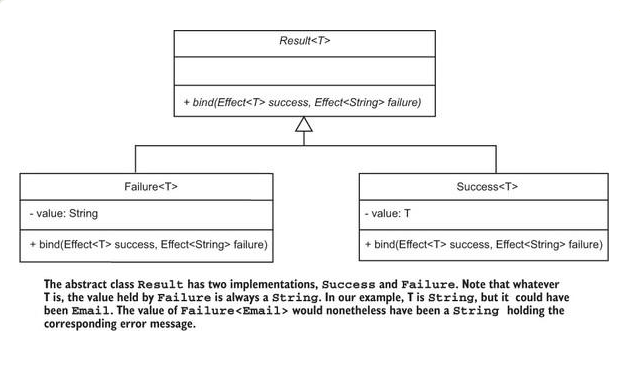
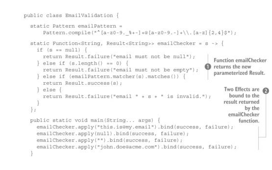

# Abstracting Control Structures.
Through this chapter we saw how we can transform our code from imperative way to a functional
by applying simple interfaces.



by using this design and implementing a ``Effect<T>`` interface which as its name indicates
will apply and effect over the main function we could use a ```Consumer``` from java libraries
but this is up to any developer in this case is for learning proposal.

###Hint

First, you’ll need an interface with a single method to represent an effect. 
Second, because the emailChecker function returns a Result, the validate method could 
return this Result. In such a case, you’d no longer need the validate method. Third, 
you’ll need to "bind" an effect to the Result. But because the result may be a success 
or a failure, it would be better to bind two effects and let the Result class choose which one to apply.

As a result we can build fluent and functional methods with pure functions where no side effects.
just the side effect we want.



# An Alternative to if … Else.

You can use the Java 8 implementation of Supplier or your own. The result corresponding to the condition will be represented by a Supplier<Result<T>>. To hold both, you can use a Tuple<Supplier<Boolean>, Supplier<Result<T>>>.

The Case class should define three methods:
`````java
public static<T> Case<T> mcase(Supplier<Boolean> condition,
    Supplier<Result<T>>value)

public static<T> DefaultCase<T> mcase(Supplier<Result<T>>value)

public static<T> Result<T> match(DefaultCase<T> defaultCase,
    Case<T>...matchers)
`````

The first mcase method defines a normal case, with a condition and a resulting value. The second mcase method defines a default case, represented by a subclass. The third method, match, selects a case. Because this method uses a vararg, the default case is to be put first, but will be the last to be used!

Additionally, the Case class should define the private DefaultCase subclass with the following signature:
``private static class DefaultCase<T> extends Case<T>``

I said that the class must represent a Supplier<Boolean> for the condition and a Supplier<Result<T>>> for the resulting value. The simplest way to do this is to define it as follows:
`````java
public class Case<T> extends Tuple<Supplier<Boolean>, Supplier<Result<T>>> {
    private Case(Supplier<Boolean> booleanSupplier, Supplier<Result<T>> resultSupplier) {
        super(booleanSupplier, resultSupplier);
    }
}
`````
The DefaultCase class couldn’t be simpler. It’s only a marker class, so you only have to create a constructor calling super:
`````java
private static class DefaultCase<T> extends Case<T> {
    private DefaultCase(Supplier<Boolean> booleanSupplier, Supplier<Result<T>> resultSupplier) {
        super(booleanSupplier, resultSupplier);
    }
}
`````


The match method is more complex, but that’s an overstatement because it has only three lines of code:
````java
@SafeVarargs public static<T> Result<T> match(DefaultCase<T> defaultCase,
    Case<T>...matchers){
    for(Case<T> aCase:matchers){
    if(aCase._1.get())return aCase._2.get();
    }
    return defaultCase._2.get();
    }
````


